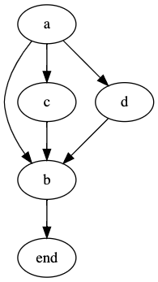

# Graphviz Steps Parser

[Graphviz](https://graphviz.org/) files parser to allow multiple Graphviz sequences in one file.

Have you ever wanted animated Graphviz diagrams? The kind you see when you look at the
demos in [d3-graphviz](https://github.com/magjac/d3-graphviz).

You could just use d3-graphviz, but you have to code all the examples and create new dot source strings for each step in the animation.

Or you can use the Graphviz Steps Parser which parses a Graphviz dot string with some extra annotations as comments, and it identifies each step in the diagram and helps you generate sequences of dot strings suitable for animating via the d3-graphviz library.

## Quick Example

This Graphviz dot source, has 3 steps in it, you can spot them as the `#` comments in the source.

```
digraph G {
    a -> b
    # STEP add c
    a -> c
    c -> b
    # STEP add d
    a -> d
    d -> b
    # END
    b -> end
}
```

This will still render as a normal Graphviz diagram:



If you use the same source with Graphviz Steps Parser to parse it into individual dot strings then you can render each of them using d3-graphviz then you can render it as an animated graph.


[online example](https://eviltester.github.io/graphviz-steps/generate.demo.html)

## Using it yourself

If you are familiar with Javascript then you should be able to get started by looking at the source code for the [generate.demo.html](https://github.com/eviltester/graphviz-steps/blob/main/docs/generate.demo.html) application.

Until we create a proper editor, if you want to work from your own `dot` file you can:

- open [editor example](https://eviltester.github.io/graphviz-steps/edit-anim.html)
- click anywhere on the screen
- paste in your Graphviz graph at the input prompt
- click [OK]

## Basic Example

All directives to control the animation are added as "#" comments in the Graphviz.

e.g.

```
digraph G {
    a -> b
    # STEP
    b -> c
    # END
}
```

The two most important are:

- "# STEP" lines under this are part of a step
- "# END" everything after this is the end of the graph

Everything before the first "# START" is included in all animation steps.

e.g. the example above converts into two graphs

```
digraph G {
    a -> b
}
```

```
digraph G {
    a -> b
    b -> c
}
```

## Reference

- All directives should be added to the graph as `#` comment lines e.g. `# STEP`
- There are 3 top level directives `STEP`, `END`, `DIRECTIVE`
- All animated Graphs should have an `END` directive comment to make sure the generated graph is valid
- A `STEP` directive comment starts an animation step and everything under it until the next step is included
- Directives can be named e.g. `# Step add c` to describe what happens in the step
- The name can be used with lower level directives
- There are 3 lower level directives `UNCOMMENT_//`, `DISABLE_STEP <stepname>`, `ENABLE_STEP <stepname>`
- `DISABLE_STEP  <stepname>` will disable an earlier named step
- Lower level directives can be nested for easier visibility
- A `DIRECTIVE` comment is used when we want to define some lower level directives which apply for to all following steps e.g.

```
digraph G {
    a -> b
    # STEP remove later
    a -> c
    # DIRECTIVE
    #   DISABLE_STEP remove later
    # STEP
    a -> d
    # STEP
    d -> e
    # END
}
```

- A `DIRECTIVE` comment does not output a Graphviz dot graph, it is applied to later steps
- `ENABLE_STEP  <stepname>` will enable an earlier named step e.g.

```
digraph G {
    a -> b
    # STEP enable disable
    a -> c
    # DIRECTIVE
    #   DISABLE_STEP enable disable
    # STEP
    a -> d
    # DIRECTIVE
    #   ENABLE_STEP enable disable
    # STEP
    d -> e
    # END
}
```

- `UNCOMMENT_//` will uncomment any `//` commented lines in the step

```
   # STEP add c
   #    UNCOMMENT_//
   // a -> c
```

- `UNCOMMENT_//` is used when we might want to use the Graphviz as a 'final' output in a normal Graphviz tool and we have some temporary Graphviz commands that are useful when shown as an intermediate step, but not in the final output.


## Hints and Tips

- I find it useful to create the animation from top to bottom.
- Disabling steps later when I don't need them.
- If I find that a section is temporary and not needed for the final output then I comment the Graphviz lines out with `//` and add `UNCOMENT_//` as a lower level directive in the `STEP`
- Graphviz handles duplicate definitions well so we don't have to disable previous steps e.g.

```
digraph G {
    a -> b
    a[label="Hello"]
    # STEP
    b [label="World"]
    # STEP
    b [label="World", shape=square]
    # STEP
    b [label="World", shape=square, style=filled, fillcolor=red]
    # END
}
```

This project is still in its early stages so I've been using screen capture tools to record the graphs from the editor and example html pages.

## Examples

There are examples in the test code:

- [test code](https://github.com/eviltester/graphviz-steps/blob/main/src/library/graphvizStepParser.test.ts)

There is a longer example here:

- [meta model of testing](https://github.com/eviltester/graphviz-steps/blob/main/examples/001-meta-model-of-software-testing.test.dot) this also demonstrates embedded comments to make a diagram self-explanatory.
